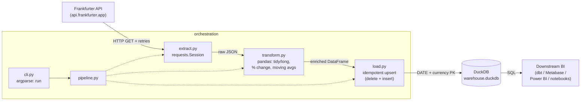

# python-elt-pipeline — FX rates ELT

[](https://github.com/pavelszr/python-elt-pipeline/actions/workflows/ci.yml)


A small, production-style **ELT pipeline** that extracts daily foreign-exchange
rates from a free public API, transforms them into a tidy analytics-ready table
with pandas, and loads them **idempotently and incrementally** into a local
DuckDB warehouse ready for downstream BI.

It is deliberately scoped to show the *software-engineering rigor* an Analytics
Engineer brings to data work: a proper `src/` package, separation of concerns,
full type hints, retries/timeouts on the network boundary, idempotent loads,
unit tests with mocked I/O, linting, pre-commit, and CI.

---

## Architecture



| Stage         | Module                  | Responsibility                                                        |
| ------------- | ----------------------- | -------------------------------------------------------------------- |
| **Extract**   | `extract.py`            | HTTP calls with timeouts + exponential-backoff retries, error wrap   |
| **Transform** | `transform.py`          | Pure pandas: long/tidy format, daily % change, moving averages       |
| **Load**      | `load.py`               | DuckDB upsert (delete overlapping keys, then insert) — idempotent     |
| **Orchestrate** | `pipeline.py`         | Wire E → T → L; no argument parsing, no logging setup                 |
| **Interface** | `cli.py` / `__main__.py`| `argparse` CLI with a `run` subcommand                               |
| **Config**    | `config.py`             | Env-based `Settings` dataclass (`FX_*`) with sensible defaults        |
| **Logging**   | `logging_conf.py`       | Structured `key=value` logs, idempotent handler setup                |

---

## Why FX rates? (fintech / LatAm angle)

Currency data is a clean, free, *real* dataset that maps directly onto fintech
and cross-border problems. The default symbol set intentionally includes the
**Honduran Lempira (HNL)** and **Mexican Peso (MXN)** alongside EUR/GBP — the
exact remittance and cross-border-payment corridors a LatAm-focused fintech
cares about. The base currency, symbols, date range, and moving-average windows
are all configurable, so the same pipeline generalizes to any rate-monitoring
or treasury use case.

[Frankfurter](https://www.frankfurter.app/) is used as the source because it is
free, **needs no API key**, and exposes a simple time-series endpoint, which
keeps the repo runnable by anyone reviewing it.

---

## Quickstart

```bash
# 1. Install (editable) with dev tooling
make setup
# or, without make:
python -m pip install -e ".[dev]"

# 2. Run the pipeline for a date range
make run START=2024-01-01 END=2024-03-01 BASE=USD SYMBOLS=EUR,GBP,HNL,MXN
# or, directly:
python -m fxpipeline run --start 2024-01-01 --end 2024-03-01 \
    --base USD --symbols EUR,GBP,HNL,MXN
```

This writes a `warehouse.duckdb` file in the working directory. Re-running an
**overlapping** date range updates existing rows in place — it never duplicates.

### Inspect the result

```python
import duckdb

con = duckdb.connect("warehouse.duckdb")
print(con.sql("""
    SELECT date, currency, ROUND(rate, 4) AS rate,
           ROUND(pct_change, 3) AS pct_change, ROUND(ma_7, 4) AS ma_7
    FROM fx_rates
    WHERE currency = 'HNL'
    ORDER BY date
    LIMIT 5
"""))
```

---

## Sample output

Real rows produced by the pipeline (`USD` base, January 2024), abbreviated:

| date       | base_currency | currency | rate    | pct_change | ma_7    |
| ---------- | ------------- | -------- | ------- | ---------- | ------- |
| 2024-01-08 | USD           | EUR      | 0.9136  | -0.228     | 0.9126  |
| 2024-01-09 | USD           | EUR      | 0.9141  |  0.055     | 0.9128  |
| 2024-01-10 | USD           | EUR      | 0.9136  | -0.055     | 0.9141  |
| 2024-01-11 | USD           | EUR      | 0.9102  | -0.373     | 0.9137  |
| 2024-01-08 | USD           | HNL      | 24.6612 |  0.000     | 24.6612 |

- `rate` — units of the target currency per 1 unit of base (e.g. EUR per USD).
- `pct_change` — day-over-day percentage change, computed **per currency**.
- `ma_7` / `ma_30` — simple moving averages (`min_periods=1`), per currency.

---

## Configuration

All settings are environment variables prefixed `FX_`; every one has a default,
so the pipeline runs with zero configuration. CLI flags override the base /
symbols for a single run.

| Variable             | Default                        | Description                                      |
| -------------------- | ------------------------------ | ------------------------------------------------ |
| `FX_API_BASE_URL`    | `https://api.frankfurter.app`  | Base URL of the Frankfurter API                  |
| `FX_BASE_CURRENCY`   | `USD`                          | Base (quote) currency                            |
| `FX_SYMBOLS`         | `EUR,GBP,HNL,MXN`              | Comma-separated target currencies                |
| `FX_DB_PATH`         | `warehouse.duckdb`             | DuckDB file path (`:memory:` for ephemeral)      |
| `FX_TABLE_NAME`      | `fx_rates`                     | Destination table                                |
| `FX_MA_WINDOWS`      | `7,30`                         | Moving-average window sizes (days)               |
| `FX_REQUEST_TIMEOUT` | `30.0`                         | Per-request HTTP timeout (seconds)               |
| `FX_MAX_RETRIES`     | `3`                            | Max HTTP retry attempts                          |
| `FX_BACKOFF_FACTOR`  | `0.5`                          | Exponential backoff factor between retries       |

### CLI

```
python -m fxpipeline run \
    --start YYYY-MM-DD   (required)
    --end   YYYY-MM-DD   (default: today)
    --base  USD          (default: FX_BASE_CURRENCY)
    --symbols EUR,GBP,…   (default: FX_SYMBOLS)
    --log-level INFO
```

---

## Testing

```bash
make test
# or:
pytest --cov=fxpipeline --cov-report=term-missing
```

The suite (33 tests, ~99% line coverage) covers:

- **Transform** — exact `pct_change` / moving-average values on small fixed
  DataFrames, per-currency isolation, empty-input handling, no input mutation.
- **Extract** — success path and every error branch (non-200, bad JSON, missing
  key, network failure) against a **mocked session** — no real network calls.
- **Load** — idempotency: re-running and overlapping-range runs leave exactly
  one row per `(date, base_currency, currency)`, with updated values winning.
- **Config / CLI / logging / pipeline** — env overrides, argument parsing and
  validation, and an end-to-end run with the extract layer mocked.

Lint and format:

```bash
make lint     # ruff check
make format   # ruff format + ruff check --fix
```

---

## Design decisions

**Separation of concerns / testability.** The network boundary lives only in
`extract.py`; `transform.py` is *pure* (DataFrame in, DataFrame out) so it is
trivially unit-testable with fixed inputs and no mocking. `pipeline.py`
orchestrates but parses no arguments and configures no logging — that lives in
`cli.py`. This is what makes the transform tests assert exact numeric values and
the extract tests run with zero network access.

**Idempotency by construction.** The warehouse table has a composite primary key
`(date, base_currency, currency)`. Each load **deletes overlapping keys, then
inserts** the new batch inside the same connection. Re-running any range — or an
overlapping one — converges to exactly one row per key, with the latest fetch
winning. This is the property that lets the pipeline be scheduled safely and
re-run after a failure without manual cleanup.

**Incrementality.** Loads operate only on the requested date range, so a daily
schedule fetches just the new window. DuckDB is embedded (no server), keeping the
demo self-contained while remaining a real columnar analytics engine.

**Resilience at the edge.** HTTP calls use bounded timeouts and a `urllib3`
`Retry` with exponential backoff on transient statuses (429/5xx), wrapping
failures in a typed `ExtractError`. Retries live exactly where flakiness does —
the network — and nowhere else.

**Config over hardcoding, no secrets.** Everything is an env-overridable
default; the source needs no API key and the repo contains none. `.env` files
are gitignored.

**Tooling parity with the team.** `ruff` (lint + format), `pre-commit`, and a
GitHub Actions matrix (3.11/3.12) running lint + format-check + tests give the
repo the same green-check guarantees a real codebase ships with.

---

## Project layout

```
python-elt-pipeline/
├── src/fxpipeline/
│   ├── __init__.py        # package metadata
│   ├── __main__.py        # enables `python -m fxpipeline`
│   ├── config.py          # env-based Settings + RunRequest
│   ├── logging_conf.py    # structured logging
│   ├── extract.py         # HTTP fetch with retries/backoff
│   ├── transform.py       # pure pandas transforms
│   ├── load.py            # idempotent DuckDB upsert
│   ├── pipeline.py        # E → T → L orchestration
│   └── cli.py             # argparse CLI (`run`)
├── tests/                 # pytest: transform, extract, load, config, cli, ...
├── .github/workflows/ci.yml
├── pyproject.toml         # metadata + ruff + pytest + coverage config
├── requirements.txt
├── Makefile               # setup / lint / format / test / run
├── .pre-commit-config.yaml
└── .gitignore
```

---

## License

MIT — see `pyproject.toml`.
